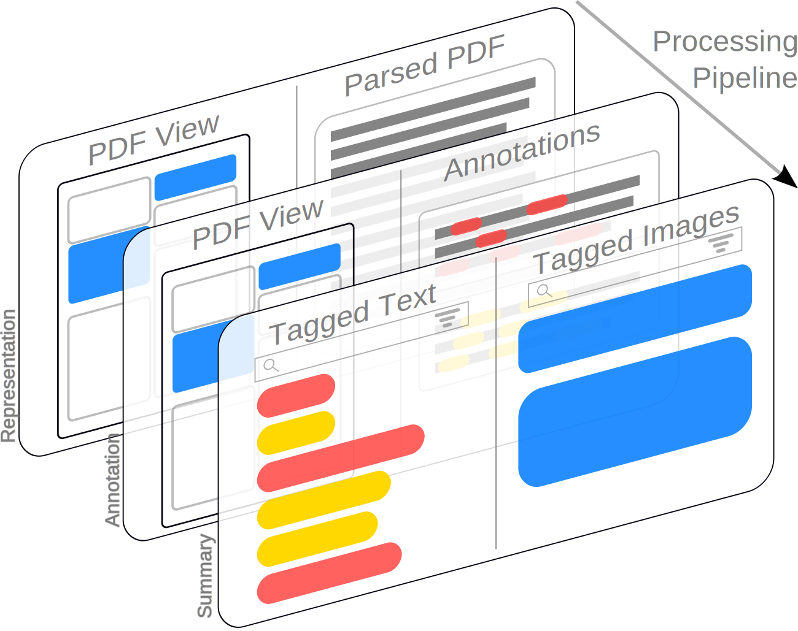

# Collage

Code for the Collage Tool, a part of the HT-MAX project.





Collage is a tool designed for rapid prototyping, visualization, and evaluation of different 
information extraction models on scientific PDFs. Further, we enable both non-technical users
and NLP practitioners to inspect, debug, and better understand modeling pipelines by providing 
granular views of intermediate states of processing.

This demo should be available and running at [this URL](http://windhoek.sp.cs.cmu.edu:8501). This
server can sometimes be unstable. If it is having issues when you try to access it, please
follow the Docker Compose instructions below.

## Setup/Running the Demo

For convenience, we've Dockerized all of the components of this system. To get started with the demo,
simply run:

```commandline
docker compose up
```

In the root directory of the repo. On our machines, this takes ~20 minutes to complete, largely
because of ChemDataExtractor having to download a number of models. If you do not need 
ChemDataExtractor, of want to speed uip the build process significantly, comment out the 
`chemdataextractor` service from `compose.yaml`. This sets up a Docker Compose network with three 
containers: the interface, an instance of GROBID, to get reading order sections, and the 
ChemDataExtractor service.

Alternatively, you can run the interface and Grobid separately. To build the interface docker 
image, run from the repo root:

```commandline
docker build -t collage_interface .
```

And run the Grobid image with the command from 
[their documentation](https://grobid.readthedocs.io/en/stable/Run-Grobid/):
```commandline
docker run --rm --gpus all --init --ulimit core=0 -p 8070:8070 grobid/grobid:0.8.0
```
(note that this command requires `nvidia-docker`. Grobid runs fine without it, you can just 
remove `--gpus all` from the command.)


To configure the application, modify config in `app_config.py` - this allows you to specify the 
Grobid and ChemDataExtractor URLs, API keys for either LLM services or MathPix

## What's in this repo?

Collage has three primary components:

- A [PaperMage](https://github.com/allenai/papermage) backbone that underlies our PDF processing, 
defined in `papermage_components/Materials_Recipe.py`
- Three software interfaces to accelerate the rapid prototyping of different kinds of models. These
interfaces are designed around token classification, i.e. classic information extraction models, 
text-to-text models, such as LLMs, and multimodal models to process things like tables. These 
interfaces are defined in `papermage_components/interfaces`. 
- A frontend, built in streamlit, that automatically visualizes modeling results produced by those 
interfaces. The landing interface, where users can upload papers and customize the processing they 
run on them, is in `Upload_Paper.py`. The three other interface views are defined in the `pages/`
package.

### Extending Collage by implementing interfaces

This repo contains the interfaces discussed above, along with several implementations of those
repositories. These implementations provide the blueprint for how to implemen,t the interfaces in a 
number of different ways, including in-memory implementations right in the pipeline, small, 
Dockerized services for components with complicated environment requirements that may not be 
compatible with Collage, as well as a few that use external APIs. We outline these components,
and how they implement their interface below. Note that because Collage is a prototyping tool, 
it does not aim for efficiency: all models are run on CPU. At the level of one paper, which is what
the interface allows, the pipeline takes around a minute to annotate a paper. 

Each interface requires users to specify the following:
- `predictor_identifier`: A property method that returns a readable identifier for the predictor,
  to be displayed in the visual interface. This is typically the name of the underlying model 
  used to do the tagging.
- `entity_to_process`: a parameter in the superclass constructor that specifies the PaperMage 
  `Entity` to annotate. This corresponds to whatever semantic segmentation comes from the 
  pipeline - it can be sections in reading order, tables, paragraphs, etc. 

Finally, for a new implementation to be visualized in the frontend, it must be registered in 
`local_model_config.py`, by adding a new `LocalModelInfo` object to the `MODEL_LIST` object, 
which contains a model name, a description, and a function that takes no parameters that returns 
an instance of the predictor. New parameters to be passed to predictor constructors should be 
declared in `app_config.py`


#### **Token Classification Interface** - `TokenClassificationPredictorABC`:

This interface is intended for any model that produces annotations of spans in text, i.e. most 
"classical" NER or event extraction models. Users are required to override the following methods:


- `tag_entities_in_batch`: This method takes a list of sentences, and for each produces a list 
  of tagged entities, wrapped in the `EntityCharSpan` dataclass. In the default implementation, 
  this batch is composed of the sentences in each paragraph. Implementors can also optionally 
  override the `generate_batches` method for more efficient batching. 

Current implementations:
- `HfTokenClassificationPredictor`: this wraps any HuggingFace model that follows the 
  `TokenClassification` interface and allows it to be used in Collage. This model is run inside 
  the same container as Collage, and therefore needs to be compatible with the version of 
  `transformers` in the environment.
- `ChemDataExtractorPredictor`: this predictor wraps around 
  [`ChemDataExtractorv2`](http://www.chemdataextractor2.org/). Because ChemDataExtractorv2 
  requires Python<3.8, we spin the annotation part of this into a small FastAPI wrapper, which 
  we then Dockerize with Python3.7. The predictor calls the API to annotate documents. 

#### **Text Prediction Interface** - `TextGenerationPredictorABC`:
Given the prominence of large language model-based approaches, this interface is designed to 
allow for text-to-text prediction. This interface can be extended by:

- overriding the `generate_from_entity_text` method (required): this method allows the user to 
  specify a text-to-text function that applies the method of their choice.
- overriding the `postprocess_to_dict` method (optional): This method allows users to 
  postprocess the results of the above method into a dict that can be displayed as a table. This 
  method is to allow for LLM results in structured format to be aggregated and displayed in the 
  Summary view. 

Current implementation:

- `LiteLLMCompletionPredictor`: this predictor allows for prompting and receiving results from 
  multiple LLMs via API. We configure it to allow users to query OpenAI an Anthropic LLMs, and 
  additionally allow users to bring their own API key to try the demo. Entered API keys are only 
  stored in the streamlit session state, and are lost when the user disconnects.

#### **Image Prediction Interface** - `ImagePredictorABC`:

 Given the focus on tables and charts that many of our interview participants discussed, and the 
 fact that table parsing is an active research area, we additionally provide an interface for 
 models that parse images, the `ImagePredictorABC` in order to handle multimodal 
 processing, including tables. Predictors that implement this interface return an output in the 
 form of an `ImagePredictionResult`, a union type that allows users to return any combination of 
 a raw prediction string, a dict that represents a table, a list of bounding boxes, or a 
 predicted string. All of these representations, if present, are rendered in the frontend view.
 
This interface allows users two options of method to override: 

- `process_image`: for predictors that only need access to the image, e.g. for captioning, or 
  predictors that do their own OCR, users can implement just the `process_image` method.
- `process_entity`: for predictors that need access to more features of PaperMage's multimodal 
  representation, users can implemnent the `process_entity` method, which passes in each entity 
  of the layer. Users can then access that entity's image, text, etc. 

Current Implementations:
- `TableTransformerStructurePredictor`: This predictor uses the Microsoft Table transformer to 
  predict bounding boxes, and then intersects those bounding boxes with PaperMage `Token`s to 
  get a parsed table representation. It overrides `process_entity`, and returns a set of predicted 
  cell bounding boxes, as well as a parsed table representation.
- `MathPixTableStructurePredictor`: This predictor calls the commercial 
  [MathPix](https://mathpix.com) API to parse the content of tables. It overrides the  
  `process_image` method, and returns only a parsed table representation. NOTE: because it 
  requires an API key, the MathPix predictor is disabled in the running web interface. To test 
  it out, get your own MathPix API key, and enter the credentials in `app_config.py`

### Other implemented components:

- `GrobidReadingOrderParser`: this parser uses [GROBID](https://github.com/kermitt2/grobid) to 
  parse documents into a semantic representation based on document structure. This allows us to 
  e.g. filter predictions by their source section, or segment batches based on section and 
  paragraph.
- `SciSpacySentencePredictor`: a reimplementation of the original PaperMage sentence parsed 
  based on PySBD to use SciSpacy instead. This results in better sentence boundary prediction in 
  the case of e.g. compounds, which contain periods in their names and cause general-domain 
  sentence segmenters to fail.

### Scripts

This repo contains the following scripts:

`parse_papers_to_json.py`: The script parses the content from PDFs into structured representations 
in json. Currently, it runs the `MaterialsRecipe` on a specified folder of papers, and dumps the json
representations to the specified output folder.

### Notebooks

To aid development, this repo contains two notebooks that facilitate quicker development of 
PaperMage predictors. `dev_run_recipe_and_serialize.ipynb` takes a new PDF, runs that 
`MaterialsRecipe` on it, and serializes the result. `dev_run_recipe_and_serialize` opens a paper 
from the parsed json, and allows further manipulation.


## [CMU Collaborators] Getting and using data

The testing data for this project is managed and versioned by [DVC](https://dvc.org), and it is stored in
[this Google Drive folder](https://drive.google.com/drive/u/0/folders/1XNbshzrpG01caal8ftSpF3WOrlUU2y7G).
Data and checkpoints should be stored in the `data/` folder. For this project, we are symlinking 
in the PDF data that we store in the [NLP Collaboration Box Folder](https://cmu.app.box.com/folder/189367159764?s=8mi0zv3qbo4hjiun36y87c2vxs2y0l08), e.g.:

```bash
ln -s $BOX_SYNC_FOLDER/NLP-collaboration-folder/AM_Creep_Papers data/AM_Creep_Papers
```

Data derived from those PDFs, model checkpoints, etc. will be stored in the `data/` folder and 
managed with DVC.

You can find instructions for installing DVC [here](https://dvc.org/doc/install). Once you have DVC installed, run 
`dvc pull` from the root of the repo. This will pull down all the files that have been checked into 
DVC thus far. This will ask for permission for DVC to access the files in your Google Drive; 
you should proceed with your CMU account. 

DVC works in a similar fashion to [git-lfs](https://git-lfs.github.com/):
it stores pointers and metadata for your data in the git repository,
while the files live elsewhere (in this case, on Google Drive). As you
work with data, such as in [the DVC tutorial](https://dvc.org/doc/start/data-and-model-versioning), DVC will automatically add the files you have 
tracked with it to the `.gitignore` file, and add new `.dvc` files that track the metadata associated
with those files.

### Sample Workflow

* **Pull data down** : run `dvc pull` to pull down the data file into the repository folder
* **Modify your data** : as you would without DVC, use, modify, and work with your data.
* **Add new/modified data to DVC** : using `dvc add ...` in a similar fashion to a `git add`, add 
your new or modified data files to DVC
* **Add the corresponding metadata to git** : Once the data file has been added to DVC, a 
corresponding `.dvc` file will have been created. Add or update this into git, then push.
* **Sync the locally updated DVC data with the remote** : finally, push the data itself up to Google 
Drive with the `dvc push` command.

tl;dr:

* dvc pull
* dvc add <data_file>
* git add/commit <data_file.dvc>
* git push
* dvc push